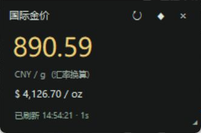
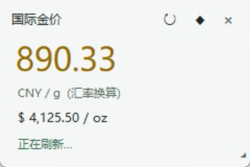
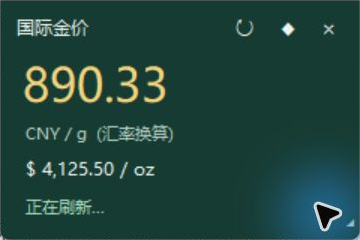
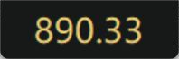

# Windows 金价桌面小组件

一个轻量的 Windows 桌面金价组件，由 [susie-jpg](https://github.com/susie-jpg) 发布。使用 Python 标准库 Tkinter，无需安装第三方运行依赖。

## 截图

以下为实际运行窗口截图，价格仅代表截图时刻。

| 深色 | 浅色 | 森林绿 |
| --- | --- | --- |
|  |  |  |

超迷你模式只显示数字：



## 功能

- 每秒自动请求金价；请求耗时超过一秒时，等待完成后继续，避免请求堆积。
- 美元/金衡盎司、人民币/克切换，保留两位小数。
- 拖动移动、窗口置顶、手动刷新。
- 深色、浅色、森林绿三种主题。
- 小号、标准、大号窗口，拖动右下角可调整大小，字体自动适应。
- 超迷你窗口为 132 × 44，只显示当前选定计价单位的数字。
- 自动保存窗口位置、大小、主题、计价单位及超迷你模式。
- 断网时保留上次价格；普通模式显示失败状态，超迷你模式以警示色显示数字。

## 运行

适用于 Windows，建议 Python 3.10 或更高版本，需要 Tkinter 支持。

1. 从 [python.org](https://www.python.org/downloads/windows/) 安装 Python，建议勾选 **Add Python to PATH**。
2. 下载本仓库并解压，或使用 Git 克隆：

   ```powershell
   git clone https://github.com/susie-jpg/windows-gold-widget.git
   cd windows-gold-widget
   ```

3. 双击 `Start.vbs`，无控制台窗口启动。也可以在终端运行：

   ```powershell
   python gold_widget.py
   ```

启动器依次查找 `pyw`、PATH 中的 `pythonw.exe` 和当前用户默认安装目录中的 Python。

## 操作

| 操作 | 方法 |
| --- | --- |
| 移动窗口 | 普通模式拖动标题，超迷你模式拖动数字 |
| 自动缩放内容 | 普通模式拖动右下角 |
| 切换计价单位 | 点击普通模式的价格或单位，或右键菜单 |
| 切换主题 | 右键 → 主题 |
| 超迷你模式 | 右键 → 窗口大小 → 超迷你（仅数字） |
| 恢复普通窗口 | 右键 → 窗口大小 → 小 / 标准 / 大 |
| 置顶、刷新 | 标题栏按钮，或右键菜单 |
| 退出 | 右键 → 退出，普通模式点击 ×，或按 Esc |

默认窗口为 240 × 160，小号为 220 × 146，大号为 360 × 240。个人设置保存在 `%LOCALAPPDATA%\GoldWidget\settings.json`，不会写入仓库。

## 行情口径

**当前数据是国际黄金现货参考价，不是银行积存金、投资金条、上海黄金交易所或金店零售报价。**

- 黄金接口：[Gold API](https://api.gold-api.com/price/XAU)，以美元/金衡盎司计价。
- 汇率接口：[ExchangeRate-API](https://open.er-api.com/v6/latest/USD)，使用每日 USD/CNY 汇率，组件每小时检查一次。
- 人民币换算公式：`美元/金衡盎司 × USD/CNY ÷ 31.1034768`。

每秒请求不代表行情源每秒更新。第三方接口可能存在延迟、限流或不可用；超过三分钟未更新的报价会标记为源延迟，超迷你模式使用警示色。银行积存金报价接入尚未实现。

## 代码结构

```text
gold_widget.py    # 主程序，含中文注释
Start.vbs         # Windows 无控制台启动器
screenshots/      # 实际运行截图
README.md         # 中文说明
```

## 常见问题

- **双击没有窗口**：先在终端运行 `python gold_widget.py` 查看错误，并确认 Python 包含 Tkinter。
- **显示 `--`**：尚未获取到报价或汇率，请检查网络，右键可手动刷新。
- **价格与银行不同**：当前是国际现货及汇率换算价格，银行有独立买入价、卖出价及价差。
- **恢复默认配置**：退出组件后删除本机设置文件，再启动。
